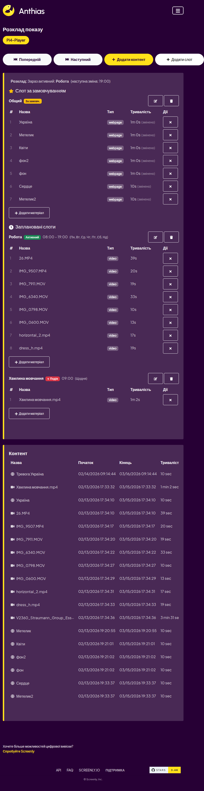
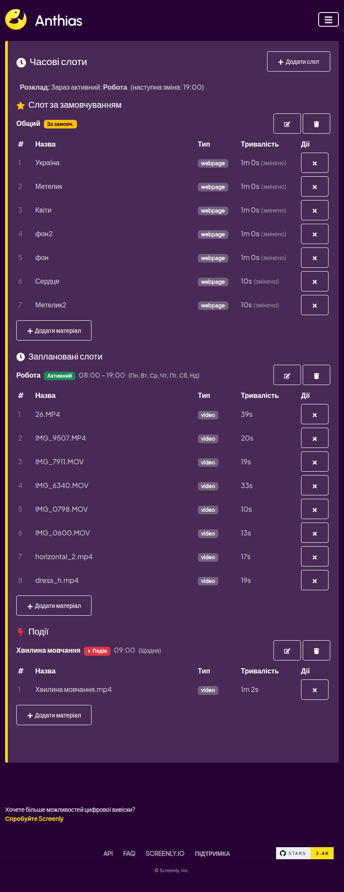
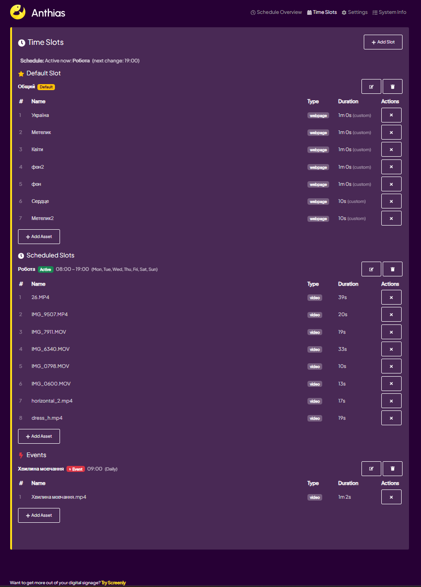
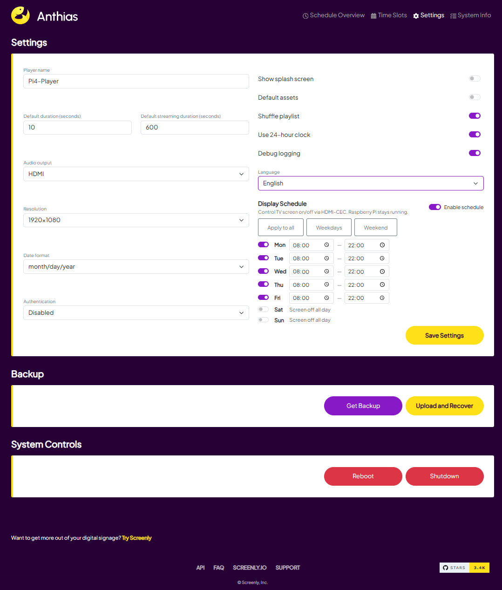
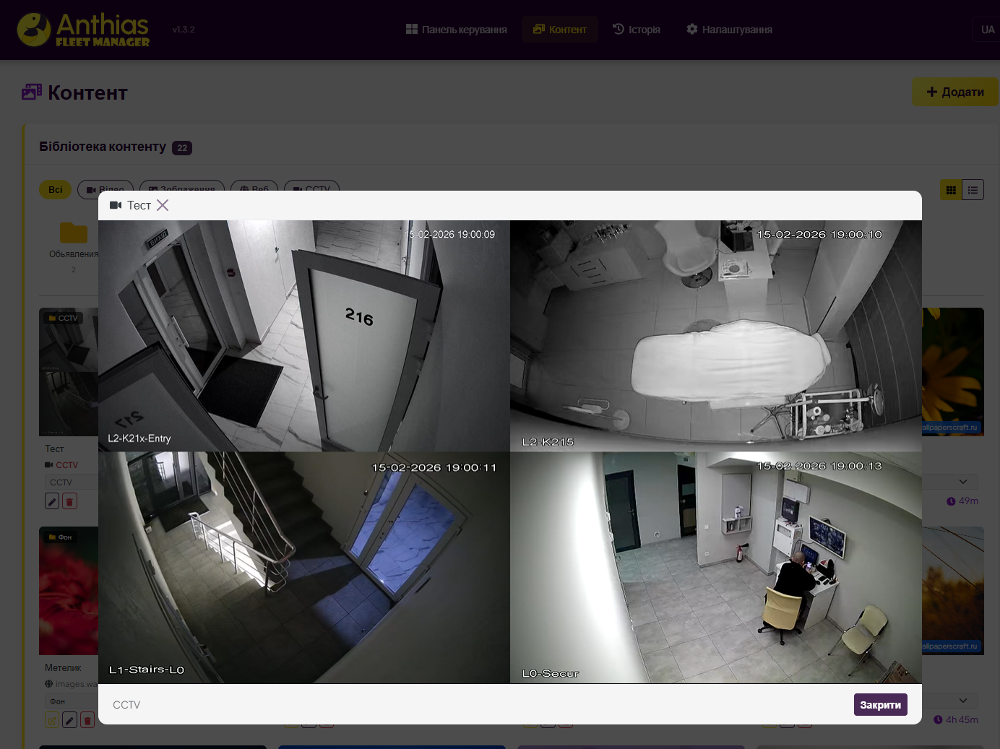

# Anthias Play — Custom Digital Signage Player for Raspberry Pi 4

A customized fork of [Screenly/Anthias](https://github.com/Screenly/Anthias) — open-source digital signage solution for Raspberry Pi.

## What's Different

This fork adds features not available in the original Anthias:

- **Schedule Slots** — default, time-based, and event-based scheduling with priority engine
- **Internationalization** — UI available in 5 languages (English, Ukrainian, German, French, Spanish)
- **HDMI Audio Auto-Detection** — VLC detects connected HDMI port and routes audio automatically
- **Video Screenshot** — captures current video frame via ffmpeg (original only supports framebuffer)
- **Silent Boot** — no rainbow splash, no kernel text, custom standby image on boot
- **View Log** — tracks playback history in local SQLite database

## Screenshots

| Home | Schedule |
|------|----------|
|  |  |

| Time Slots | Settings |
|------------|----------|
|  |  |

| CCTV |
|------|
|  |

## Docker Images

Pre-built ARM64 images are published to GitHub Container Registry on every push to `main`:

```
ghcr.io/alex1981-tech/anthias-server:latest-pi4-64
ghcr.io/alex1981-tech/anthias-celery:latest-pi4-64
ghcr.io/alex1981-tech/anthias-viewer:latest-pi4-64
ghcr.io/alex1981-tech/anthias-nginx:latest-pi4-64
ghcr.io/alex1981-tech/anthias-websocket:latest-pi4-64
ghcr.io/alex1981-tech/anthias-redis:latest-pi4-64
```

## Quick Start (Raspberry Pi 4, 64-bit)

1. Flash Raspberry Pi OS Bookworm 64-bit
2. Install Docker and Docker Compose
3. Clone and deploy:

```bash
git clone https://github.com/Alex1981-tech/Anthias_play.git ~/screenly
cd ~/screenly
docker compose up -d
```

4. Open `http://<pi-ip>` in your browser

## Fleet Manager

This player is designed to work with [Anthias Fleet Manager](https://github.com/Alex1981-tech/Anthias-fleet-manager) — a centralized management dashboard for multiple Anthias players. Fleet Manager provides:

- Remote content management
- Schedule configuration per player
- CCTV stream integration
- Player monitoring and screenshots
- Auto-update via Watchtower

## License

This project is licensed under the GNU General Public License v2.0 — same as the original Anthias.
See [LICENSE](LICENSE) for details.

## Credits

Based on [Anthias](https://github.com/Screenly/Anthias) by [Screenly](https://www.screenly.io/).
